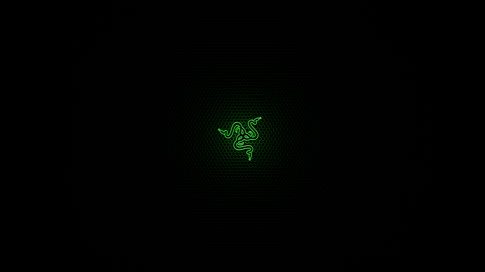

## Unofficial Razer GRUB Theme
This is a Grand Unified Bootloader Theme (the screen that appears when the computer is booting) for Linux. I use it with Ubuntu 17.10 and Windows 8.1.

For more background and information on how I got my Razer Blade 14" (2015 Model) to dual boot Linux Ubuntu alongside Windows and customization process you can read my articles:

* [Switching from Mac to Ubuntu GNOME 17.04 / 17.10](https://www.theportlandcompany.com/2017/08/14/switching-mac-ubuntu-gnome-17-04/)
* [Switching from Mac to Ubuntu](https://www.theportlandcompany.com/2012/04/03/switching-mac-os-x-ubuntu/)
* [5 Things to Customize Your Ubuntu GNOME Boot and Login Process](https://www.theportlandcompany.com/2018/02/15/5-things-to-customize-your-ubuntu-gnome-boot-login-process/)

## Pseudo Screenshot
I'm working on getting a proper screenshot, but it's basically the screenshot you see below, with the options to choose your drive to boot, a respective Linux / Windows / etc... icon beside them and that's it.

### Installation
Simply run the provided install.sh script.

* Once downloaded open Terminal.
* Navigate to the folder for the GRUB Theme by typing `cd ~/Downloads/grub-theme-razer` and hitting enter.
* Then type `sh install.sh` and hit enter.
* The script will run and output descriptive prompts explaining what it's doing and when it's done. If you get any errors that would not be normal and you can report them on GitHub from the Issues tab.
* You may have to open /etc/default/grub and add or edit this line to the bottom: GRUB_THEME=/boot/grub/themes/grub-theme-razer/theme.txt
* To change the resolution you can edit the GRUB_GFXMODE=3200x1800 for high resolution. 

#### After downloading:
1. Open Terminal
2. Navigate to the folder you just downloaded by typing `cd ~/Downloads/grub-theme-razer`
3. And execute the installation script by typing `sh install.sh`.
4. Then restart the computer.